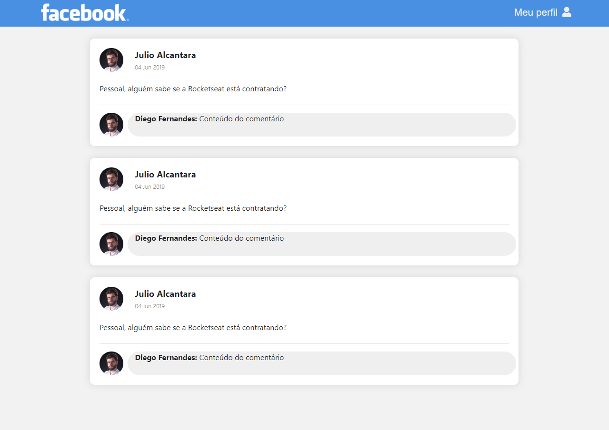

# Remaking facebook design.

### React app made using manual webpack and babel configuration.

<i>This is an old project using bootstrap and css, trying different approaches.</i>

## Single page preview:

#### To test this, run ``yarn`` or ``npm`` to install the modules and then run ``yarn dev`` or ``npm dev``, then access the website at http://localhost:8080/